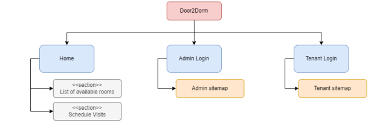
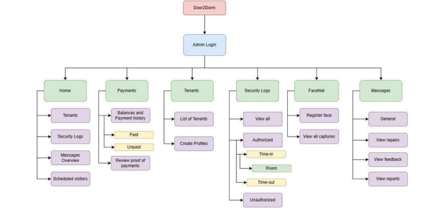
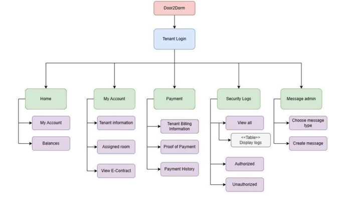

### Project Introduction

This project is a proposed application to manage Dormitories in Manila, Philippines. Door2Dorm is an IoT an IoT-based Dormitory Management System (DMS) that integrates facial and fingerprint recognition biometrics. The system enhances dormitory security and management by providing robust identity verification and access control. Through functionality testing, cross-browser testing, usability testing, user acceptance testing, and user experience testing, the study demonstrates the effectiveness of Door2Dorm. The conclusion confirms the successful development of the management system with facial recognition and fingerprint security features. It highlights additional key features such as records management, payment management, direct messaging, and security logging for administrators, tenants, and visitors. The integration of the Silent- Face-Anti-Spoofing library enhances system security. The study’s results show high user satisfaction, making Door2Dorm an efficient and credible solution for dormitory management with biometric security measures.

<a href="https://ieeexplore.ieee.org/document/10366658">Find out more with our paper! 😊</a>

---

### Sitemaps



<small>Figure 1: Door2Dorm Sitemap</small>

Figure 1 illustrates the overall main pages of the Door2Dorm application. Any user can 
view the home page, which contains sections about the list of available rooms with displayed 
pictures, and they can also schedule visits. Admin login is where the dormitory administrator can 
log in by using the credentials provided by the system developer. At the same time, the tenant login 
is for tenants who can use the credentials provided by the administrator. On each login page, once
a user (admin or tenant) successfully logs in, then they are redirected to Figure 34 and Figure 35, 
respectively.




<small>Figure 2: Door2Dorm Sitemap for Dormitory Administrator/Owner/Manager</small>

Figure 2 illustrates how a dormitory owner can navigate the website application once they 
have logged in to the system. The main pages include the following: (1) Home; (2) Payments; (3) 
Tenants; (4) Security logs; (5) FaceNet; (6) Messages. 

On the home page, the dorm admin may see an overview of the lists of tenants, security 
logs, messages, and scheduled visits. This helps them to have a high-level view of the 
administrative tasks. 

The payments page is where the administrator can set and update each tenant's billings. 
They can also view payment histories that are previously paid and acknowledged transactions from 
the tenant. 

On the tenant's page, a list of tenants and their personal information are displayed. The data 
provided for this are extracted from the fill-up form of the e-contract signed and input by the tenant. 
Lastly, upon a tenant signing an e-contract provided by the administrator and fulfilling their initial 
payments, the dorm owner can create a profile for them in the system. 

On the FaceNet page, registering facial captures for pre-processing, identification, 
classification, and recognition will take place. The admin has to provide the name of the tenant 
and a single-frontal view photo. 

On the messages page, here is where the direct communication feature between an 
administrator and tenant happens. The admin can only view different types of messages created 
by the tenant. These include general repairs, feedback, and report. The tenant has the option to use 
this feature as this only tries to centralize the processes for managing inquiries from the tenants. 
Otherwise, the tenant has the option to email, Facebook chat, or directly contact the administrator 
for their personal requests and issues.



<small>Figure 3: Door2Dorm Sitemap for Dormitory Tenants</small>

Figure 3 illustrates how a tenant may be able to access and navigate to their pages by first 
accepting the rules and regulations displayed on the page. Once accepted, then a tenant may 
redirect to the home page, and the following pages are now accessible: (1) Home; (2) My Account; 
(3) Payment; (4) Security logs; (5) Message admin. 

My account page provides full information about the tenant, which includes the following: 
(1) Full name; (2) Email; (3) Mobile no.; (4) Emergency contact/s; (5) Assigned room. 
Furthermore, to provide more information about the assigned room, then, the assigned room page 
can display the unit or room number along with the picture and the number of tenants residing. 
The details shown on this page are extracted from the e-contract they have filled upon given to 
them by the dormitory owner. 

The payment page entails the payment or billing information and its status. This is 
displayed entirely using a table with the following facts: (1) Tenant ID; (2) Bill type; (3) Charges; 
(4) Payment status. Additionally, a tenant can pay their dues and attach a copy of their receipt or 
transaction as proof of payment. They will also need the reference code from the transaction to 
confirm its validity. Lastly, upon providing their proof of payments, the administrator can review 
them for verification and acknowledgment. 

The security logs page displays the logging for those who time in and time out of the 
dormitory premises and unit. This page includes a status of an occupant – authorized or 
unauthorized. FaceNet will be responsible for identifying and recognizing the faces of tenants as 
they enter or leave the premises. Unauthorized status means that there is an individual inside the 
establishment who does not have facial and fingerprint captures. Otherwise, FaceNet will log 
authorize for those occupants recognized with both facial and fingerprint captures. 

Direct communication with a dormitory admin is done by accessing the message admin 
page, and a tenant may send any type of message for communication, which includes: (1) general; 
(2) repairs; (3) feedback; (4) reports. 

---

### Setup

**Make sure that you have MySQL workbench. This is needed to create the schemas we need for the application to work.**

<u>MySQL Schemas:</u>

- door2dorm
- door2dorm_redundant

Lastly, please take note that we will be using localhost.

--- 

Setup the database tables: 

1. Navigate to the `sql` directory 

``` 
cd .\sql\ 
```

2. Run the scripts

```
# Create the primary database
./setup.sh

# Create the redundant database (backup)
./setup_redundant.sh

# Register the Admin
./register_admin.sh
```

3. Open XAMPP Control Panel, and start the Apache Server 